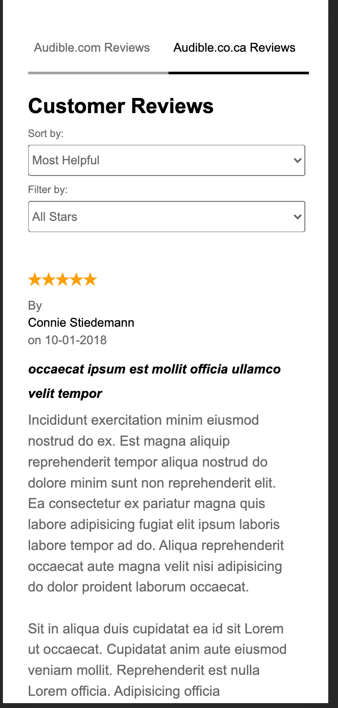
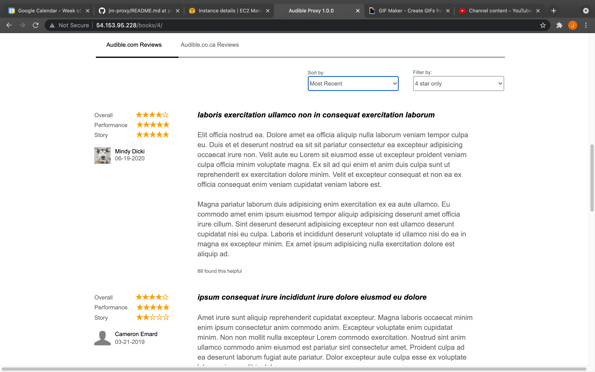
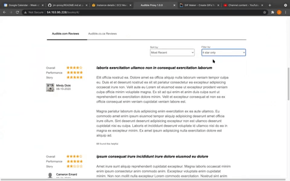

# Audible Reviews

<a href="url"></a>

<a href="url"></a>

<a href="url"></a>

<br /> <br /><br /><br /><br /><br /><br /><br /><br /><br /><br /><br /><br /><br /><br /><br />

* Audible Reviews is a component in a mock Audible page. Audible Reviews displays the reviews for a given book.

* Database Folder includes 2 database helpers: seedDB seeds the database and seedDBHelperFunctions helps with seeding the database.

* MongoDB database setup is in Database/database.js.

* Jest Tests are located in Client/ Tests.

* Style sheet is in Client/style. It uses 'less' for CSS.

* RenderDom is in Client/index.js.

* App components are in Client/src/Components

* The Server with endpoints is in Server/server.js


## Usage

* The two endpoints available are books/:id/reviews and /reviews/carouselReviews. The working endpoint for rendering reviews is books/:id/reviews. The currently non implemented path for carousel reviews is /reviews/carouselReviews.

* send <GET> request to http://yourEC2Instance:4001/books/:id/reviews
* returns multiple review objects per id
  {reviewerName: String,
  reviewerId: Number,
  review: String,
  urlString: String,
  bookName: String,
  bookId: Number,
  date: Date,
  overallStars: Number,
  performanceStars: Number,
  storyStars: Number,
  title: String,
  foundHelpful: Number,
  source: String,
  location: String}


* send <GET> request to /reviews/carouselReviews <arrayOfBookIds> returns array of infoObjects for modals / carousels
* returns
{reviewerName: String,
reviewTitle: string
date: date,
overalStars: Number}

## Installation

```bash

fork 'https://github.com/huang-pei-mei/reviews-service'
git clone /path/to/reviews.git
cd reviews-service
npm install
npm run webpack
npm run start

```


## Contributing
This page is not currently open to contributions

## License
N/A
